# Adversarial-Attacks-for-Sequential-Data-Models
Adversarial Attacks for Sequential Data Models

## Problem Description

This project introduces concealed adversarial attacks tailored for time series models. Unlike conventional attacks, concealed adversarial attacks are designed to mislead classification models (discriminators) without being easily detectable as adversarial inputs. We explore the novel challenges and opportunities in this emerging field.

Adversarial attacks include a wide range of techniques that perturb input data in order to cause misclassification or degrade model performance.

Figure 1 - Adversarial attack in time series domain 

## Dataset Description

We use publicly available dataset for hidden adversarial attack problem: [FordA dataset](http://www.timeseriesclassification.com/description.php?Dataset=FordA).

FordA dataset is a collection of time series data for binary classification. The univariate data originate from an automotive subsystem and the classification task aims to find samples with a specific anomaly. Sample from dataset is presented below. Dataset contains a total of $4921$ objects with sequence length of $500$ points.

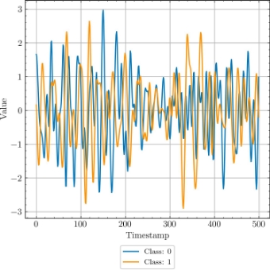

Figure 2 - Sample from processed FordA dataset 

## Time Series Classification Models

[TimesNet](https://github.com/thuml/Time-Series-Library) and our implementation of LSTM FCN models were used in the project. 

## Adversarial attacks

IFGSM and DeepFool were implemented.

Figure 3 - The relationship between accuracy and the epsilon parameter epsilon in TimesNet model with applied IFGSM adversarial attack. As epsilon increases, more perturbations are introduced into the data. Consequently, the quality of the model decreases due to the greater impact of these perturbations on its performance.

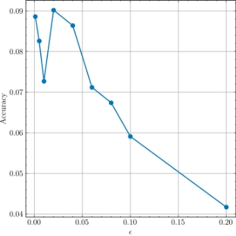

Figure 4 - The relationship between accuracy and the epsilon parameter epsilon in TimesNet model with applied DeepFool adversarial attack. The quality of the model does not decrease with increasing number of epsilon as in IFGSM model. Increasing the value of epsilon in DeepFool does not necessarily make the     adversarial attack more potent.

## Discriminator

We aim to use two options for discriminator: TimesNet and LSTM FCN. Conducted experiments showed that using different model and discriminator does not give better concealibility and effectiveness of adversarial attack, that is why we focused on the same pair for model and descriminator approach.

## Prerequisites

      !pip install -r requirements.txt

How to run our code?

Create new, edit or use ready to-go '.json' config file

All used configs can be found in configs.

    # Example of LSTM\_FCN training on pertrubed FordA dataset

    { 
      "model": { 
          "model\_name": "LSTM\_FCN", 
          "h\_sizes": [64, 64], 
          "num\_classes": 2, 
          "dilation": 1,
          "kernel\_size": 3,
          "features": [128, 128, 128],
          "in\_ch": 1,
          "bidirectional": true,
          "dropout": 0.1,
          "d\_model": 128 
          },
      "root\_path": "data/data\_mi10\_eps0.9/mi10-eps0.9.csv", "dataset\_name": "FordADiscr", 
      "batch\_size": 16,
      "num\_workers": 10,
      "device": "cuda:0", 
      "lr": 1e-3,
      "patience":10, 
      "verbose":true, 
      "delta":0, 
      "num\_epochs":30 
    }

Train the model

    !python train.py --config <config\_path>

Test the model

    !python test.py --config <config\_path>

Test adversarial attack on model

    !python test\_adv.py \
      --path\_to\_log <path\_where\_model\_logs\_are\_saved> \         
      --eps <epsilon> \
      --max\_iter <iterations\_in\_attack\_func> \
      --attack <name\_of\_the\_attack>

Test effectiveness and concealability of adversarial attack

    !python test\_discr.py \
      --path\_to\_log <path\_where\_model\_logs\_are\_saved>  \
      --path\_to\_discr\_log <path\_where\_discriminator\_logs\_are\_saved> \
      --eps <epsilon> \
      --max\_iter <iterations\_in\_attack\_func> \
      --attack <name\_of\_the\_attack>

Code performs logging all information in logs folder. You can find all saved configs, training, testing information, checkpoints in that directory after running the code.

## Code Reproducibility

You can run our base training/testing procedure without regularization using ADA.ipynb, where common ierarchy of training and testing procedure is presented.

All sourse code is provided in [src](https://github.com/bbogdanovaalina/Adversarial-Attacks-for-Sequential-Data-Models/tree/main/src) directory.

## Experiments and Results

During testing we tracked not only the strength of adversarial attack (dependency of model accuracy from epsilon), but effectiveness and concealability metrics:

  - Effectiveness = 1 - accuracy of attacked model on pertrubed data,
  - Concealability = 1 - accuracy of discriminator.

During experiment procedure, we utilized two architectures for models and discriminators: TimesNet and LSTM FCN. Also, different epsilons that define adversarial attack were used. Moreover, we experimented with different number of discriminators using regularization approach. Conducted experiments are shown in Tables 1-6.

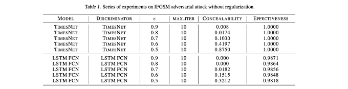

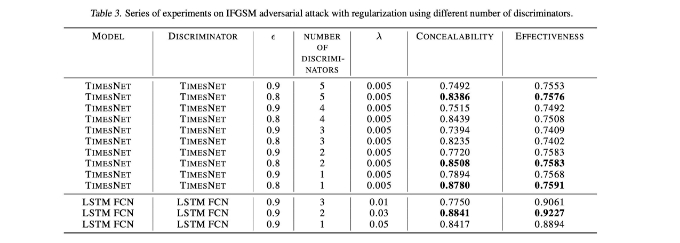

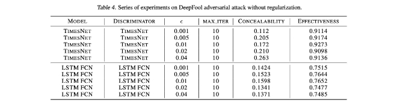

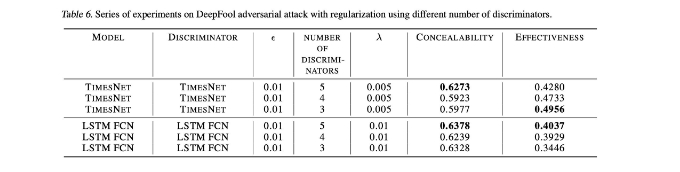

## Some examples of original and pertrubated data within concducted experiments

TimesNet model, TimesNet discriminator, IFGSM adversarial attack, no regularization

In LSTM FCN model and TimesNet discriminator approach

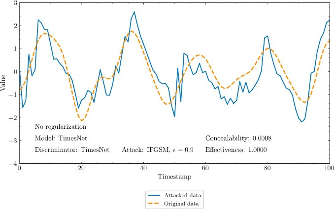

TimesNet model, TimesNet discriminator, IFGSM adversarial attack, with regularization

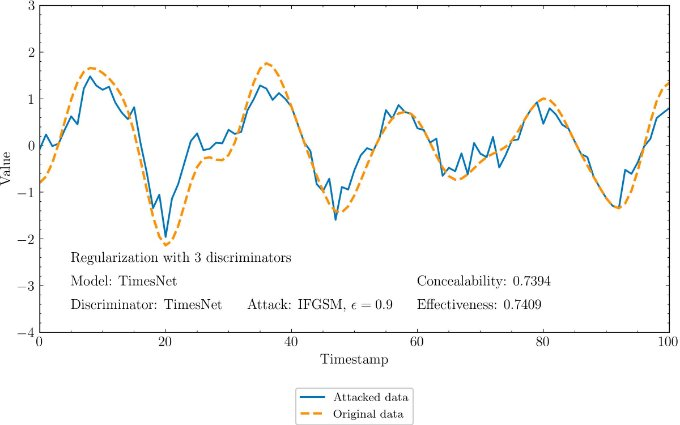

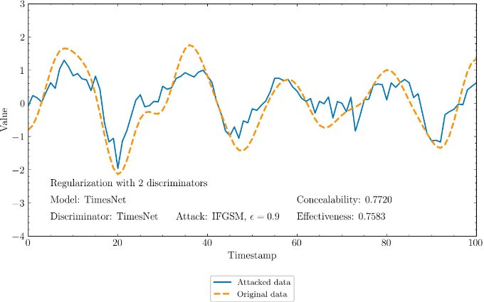

LSTM FCN model, LSTM FCN discriminator, IFGSM adversarial attack, no regularization

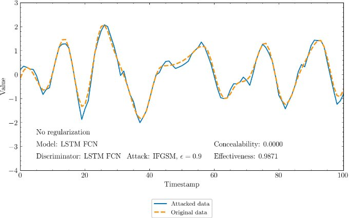

LSTM FCN model, LSTM FCN discriminator, IFGSM adversarial attack, with regularization

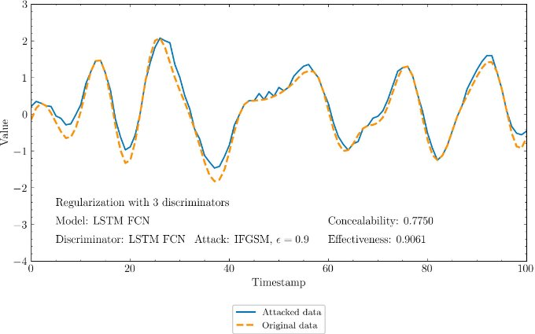

## Summary:

1. In this work a hidden adversarial attack in time series domain is presented.

2. TimesNet anf LSTM-FCN time series classifiers wete trained for time series classification task.

3. Models were attacked with IFGSM and DeepFool adversarial attacks. Discriminator models were trained for attack regularization.

4. Regularized adversarial attacks were applied and concealbility, effectiveness were estimated.

The primary objective of the project has been successfully met: enhancing the concealment of adversarial attacks through improved regularization, all while maintaining a high level of effectiveness.

## License

MIT License

Copyright (c) 2023 Alina Bogdanova, Nikita Ligostaev, Matvey Skripkin, Anastasia Sozykina

Permission is hereby granted, free of charge, to any person obtaining a copy of this software and associated documentation files (the "Software"), to deal in the Software without restriction, including without limitation the rights to use, copy, modify, merge, publish, distribute, sublicense, and/or sell copies of the Software, and to permit persons to whom the Software is furnished to do so, subject to the following conditions:

The above copyright notice and this permission notice shall be included in all copies or substantial portions of the Software.

THE SOFTWARE IS PROVIDED "AS IS", WITHOUT WARRANTY OF ANY KIND, EXPRESS OR IMPLIED, INCLUDING BUT NOT LIMITED TO THE WARRANTIES OF MERCHANTABILITY, FITNESS FOR A PARTICULAR PURPOSE AND NONINFRINGEMENT, IN NO EVENT SHALL THE AUTHORS OR COPYRIGHT HOLDERS BE LIABLE FOR ANY CLAIM, DAMAGES OR OTHER LIABILITY, WHETHER IN AN ACTION OF CONTRACT, TORT OR OTHERWISE, ARISING FROM, OUT OF OR IN CONNECTION WITH THE SOFTWARE OR THE USE OR OTHER DEALINGS IN THE SOFTWARE.
