# Adversarial Attacks for Sequential Data Models

<details>
  <summary>Table of Contents</summary>
  <ol>
    <li>
      <a href="#problem-description">Problem Description</a>
    </li>
     <li><a href="#dataset-description">Dataset Description</a>
    <li>
      <a href="#time-series-classification-models">Time Series Classification Models</a>
    <li>
      <a href="#adversarial-attacks">Adversarial Attacks</a>
    <li>
      <a href="#prerequisites">Prerequisites</a>
    <li>
      <a href="#how-to-run-our-code">How to Run Our Code?</a>
    <li>
      <a href="#code-reproducibility">Code Reproducibility</a>
    <li>
      <a href="#experiments-and-results">Experiments and Results</a>
    <li>
      <a href="#some-examples-of-original-and-pertrubated-data-within-concducted-experiments">Some Examples of Original and Pertrubated Data Within Concducted Experiments</a>
    <li>
      <a href="#paper-and-presentation">Paper and Presentation</a>
    <li>
      <a href="#summary">Summary</a>
    <li>
      <a href="#license">License</a>
    </li>
  </ol>
</details>
</p>

## Problem Description
This project introduces concealed adversarial attacks tailored for time series models. Unlike conventional attacks, concealed adversarial attacks are designed to mislead classification models (discriminators) without being easily detectable as adversarial inputs. We explore the novel challenges and opportunities in this emerging field.

<p align="center">
    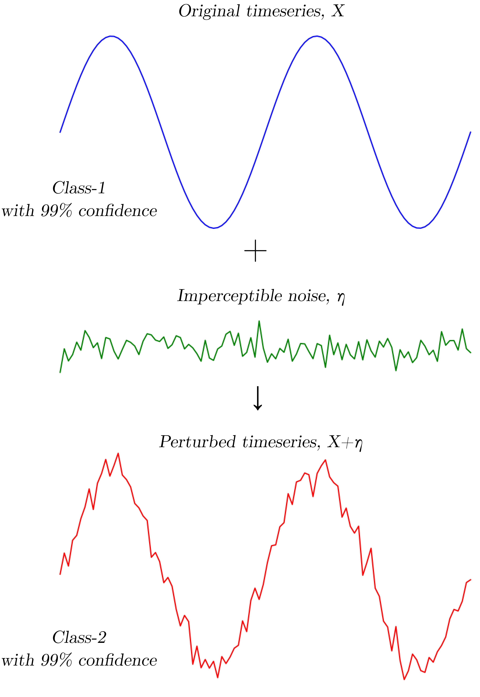
</p>

<p align="center">
Figure 1 - Adversarial attack in time series domain
</p>


## Dataset Description
We use publicly available dataset for hidden adversarial attack problem: [FordA dataset](https://www.timeseriesclassification.com/description.php?Dataset=FordA).

FordA dataset is a collection of time series data for binary classification. The univariate data originate from an automotive subsystem and the classification task aims to find samples with a specific anomaly. Sample from dataset is presented below. Dataset contains a total of $4921$ objects with sequence length of $500$ points.

<p align="center">
    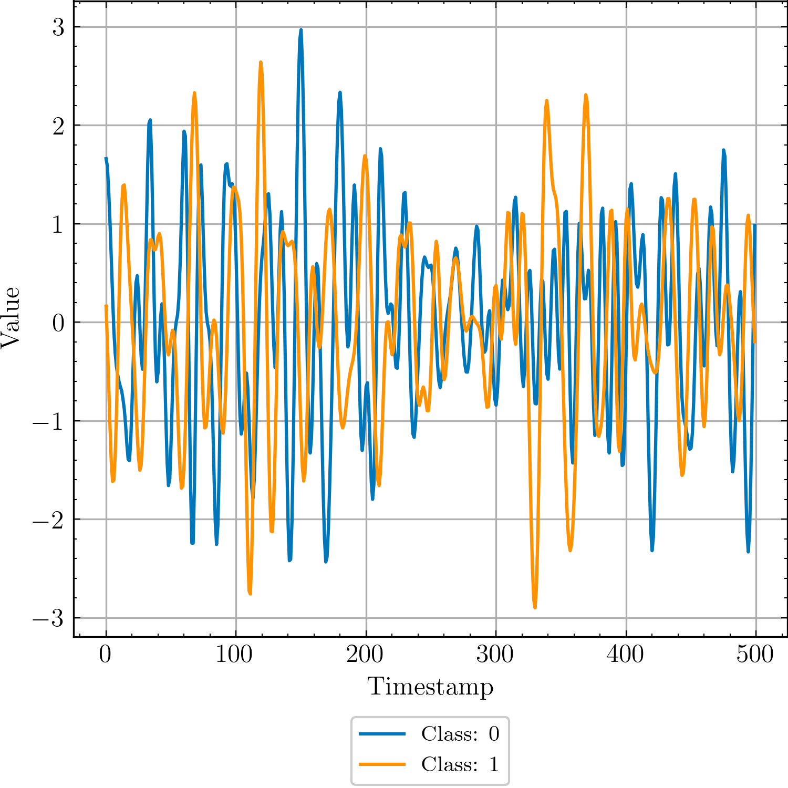
</p>

<p align="center">
Figure 2 - Sample from processed FordA dataset
</p>

## Time Series Classification Models
[TimesNet](https://github.com/thuml/Time-Series-Library) and our implementation of LSTM FCN models were used in the project.


## Adversarial Attacks
IFGSM and DeepFool were implemented.

<p align="center">
    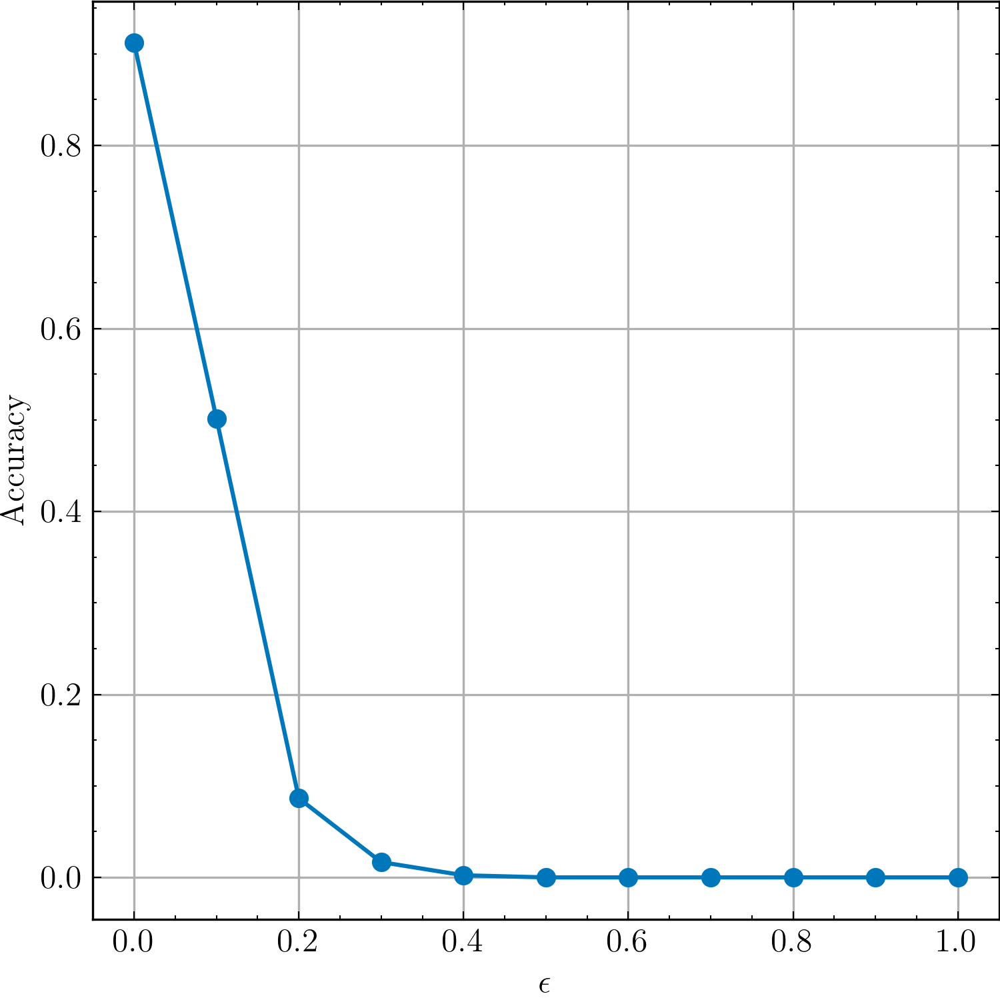
</p>

<p align="center">
Figure 3 - The relationship between accuracy and the epsilon parameter epsilon in TimesNet model with applied IFGSM adversarial attack. As epsilon increases, more perturbations are introduced into the data. Consequently, the quality of the model decreases due to the greater impact of these perturbations on its performance.
</p>

<br>
<p align="center">
    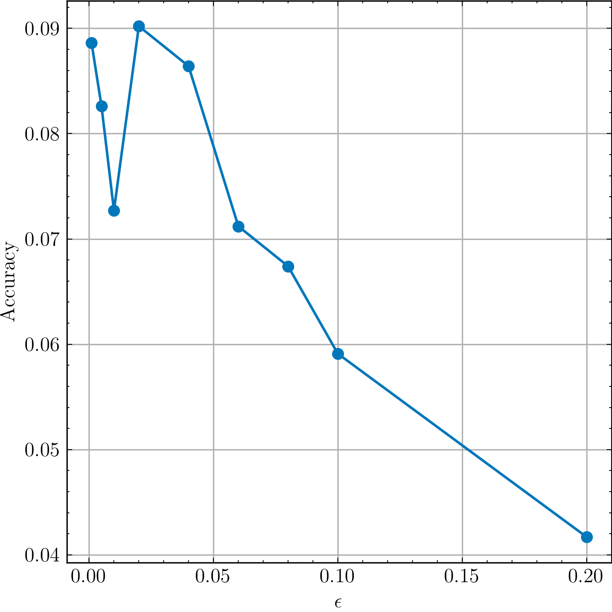
</p>

<p align="center">
Figure 4 - The relationship between accuracy and the epsilon parameter epsilon in TimesNet model with applied DeepFool adversarial attack. The quality of the model does not decrease with increasing number of epsilon as in IFGSM model. Increasing the value of epsilon in DeepFool does not necessarily make the adversarial attack more potent.
</p>


## Discriminator
We aim to use two options for discriminator: [TimesNet](https://github.com/thuml/Time-Series-Library) and LSTM FCN.
Conducted experiments showed that using different model and discriminator does not give better concealibility and effectiveness of adversarial attack, that is why we focused on the same architecture for model and descriminator pair.

## Prerequisites

```sh
    !pip install -r requirements.txt
```

## How to Run Our Code?

### Create new, edit or use ready to-go .json config file

All used configs can be found in [configs](./configs).
```sh
    # Example of LSTM_FCN training on pertrubed FordA dataset
    {
        "model": {
            "model_name": "LSTM_FCN",
            "h_sizes": [64, 64],
            "num_classes": 2,
            "dilation": 1,
            "kernel_size": 3,
            "features": [128, 128, 128],
            "in_ch": 1,
            "bidirectional": true,
            "dropout": 0.1,
            "d_model": 128
        },
        "root_path": "data/data_mi10_eps0.9/mi10-eps0.9.csv",
        "dataset_name": "FordADiscr",
        "batch_size": 16,
        "num_workers": 10,
        "device": "cuda:0",
        "lr": 1e-3,
        "patience":10,
        "verbose":true,
        "delta":0,
        "num_epochs":30
    }
```

### Train the model
```sh
    !python train.py --config <config_path>
```

### Test the model
```sh
    !python test.py --config <config_path>
```

### Test adversarial attack on model
```sh
    !python test_adv.py \
        --path_to_log <path_where_model_logs_are_saved> \
        --eps <epsilon> \
        --max_iter <iterations_in_attack_func> \
        --attack <name_of_the_attack>
```

### Test effectiveness and concealability of adversarial attack
```sh
    !python test_discr.py \
        --path_to_log <path_where_model_logs_are_saved>  \
        --path_to_discr_log <path_where_discriminator_logs_are_saved> \
        --eps <epsilon> \
        --max_iter <iterations_in_attack_func> \
        --attack <name_of_the_attack>
```

Code performs logging all information in logs folder. You can find all saved configs, training, testing information, checkpoints in that directory after running the code.

## Code Reproducibility
You can run our base training/testing procedure without regularization using [ADA.ipynb](./ADA.ipynb), where common ierarchy of training and testing procedure is presented.

All sourse code is provided in [src](./src) directory.

## Experiments and Results
During testing we tracked not only the strength of adversarial attack (dependency of model accuracy from epsilon), but effectiveness and concealability metrics: 
* Effectiveness = 1 - accuracy of attacked model on pertrubed data,
* Concealability = 1 - accuracy of discriminator.

<p align="center">
    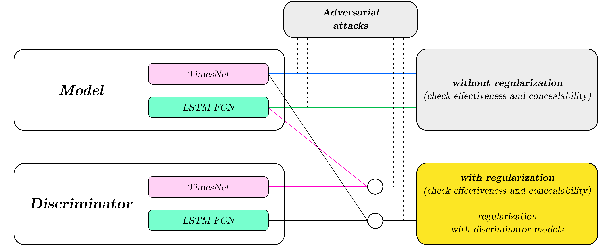
</p>

<p align="center">
Figure 5 - Proposed pipeline
</p>

During experiment procedure, we utilized two architectures for models and discriminators:
[TimesNet](https://github.com/thuml/Time-Series-Library) and LSTM FCN. Also, different epsilons that define adversarial attack were used. Moreover, we experimented with different number of discriminators using regularization approach. Conducted experiments are shown in Tables 1-6.

<p align="center">
    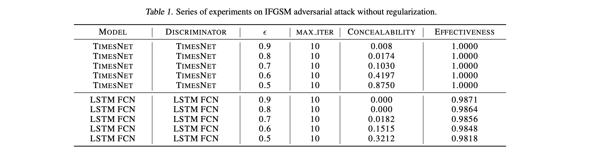
</p>

<p align="center">
    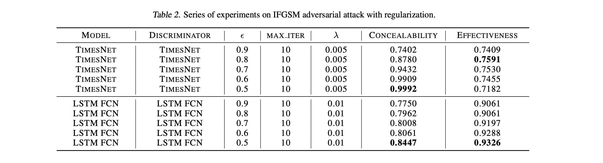
</p>

<p align="center">
    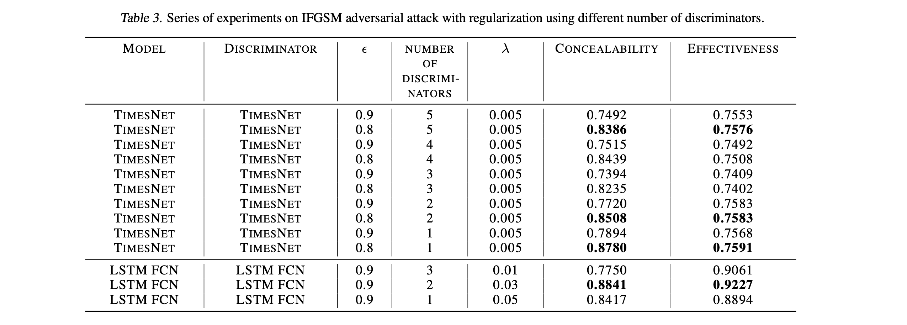
</p>

<p align="center">
    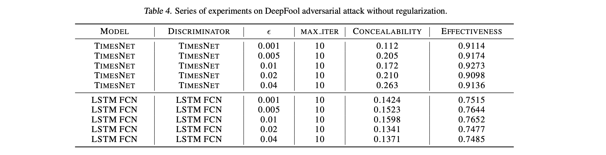
</p>

<p align="center">
    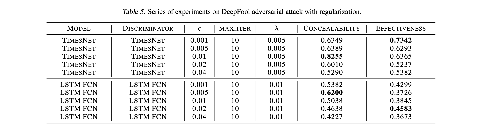
</p>

<p align="center">
    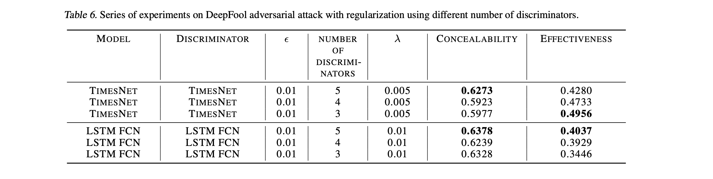
</p>

## Some Examples of Original and Pertrubated Data Within Concducted Experiments
### TimesNet model, TimesNet discriminator, IFGSM adversarial attack, no regularization
In LSTM FCN model and TimesNet discriminator approach 

<p align="center">
    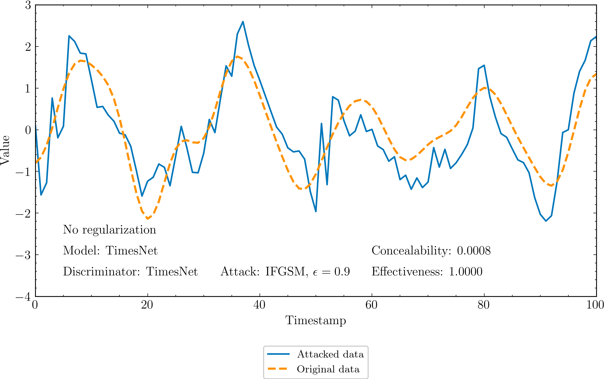
</p>

### TimesNet model, TimesNet discriminator, IFGSM adversarial attack, with regularization

<p align="center">
    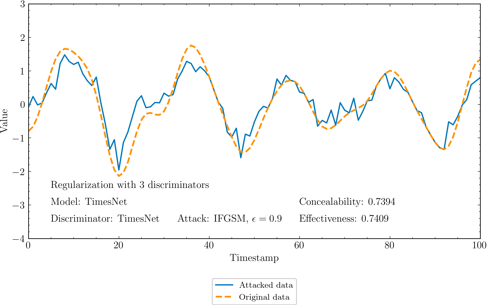
</p>

<p align="center">
    
</p>

### LSTM FCN model, LSTM FCN discriminator, IFGSM adversarial attack, no regularization

<p align="center">
    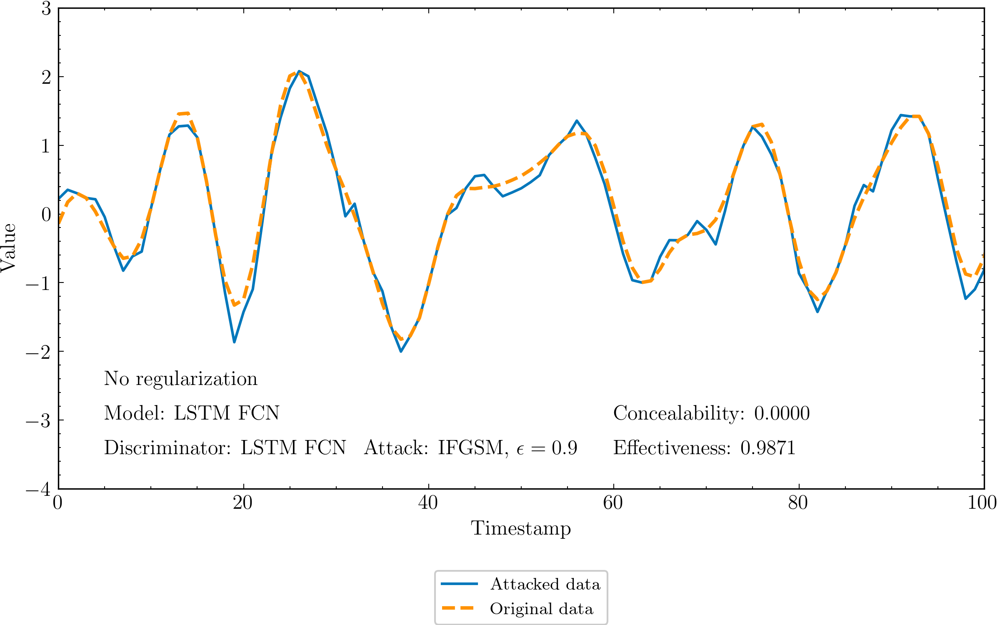
</p>

### LSTM FCN model, LSTM FCN discriminator, IFGSM adversarial attack, with regularization

<p align="center">
    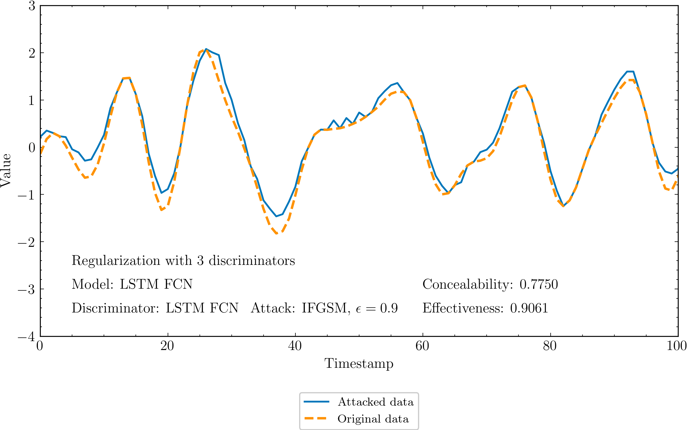
</p>


## Paper and Presentation
Adversarial Attacks for Sequential Data Models final project defence in  Models of Sequential Data course (17 October 2023, Eng, [slides](./presentation/ADA_TS_presentation.pdf), [paper](./paper/ADA_TS_paper.pdf))

## Summary
In this work a hidden adversarial attack in time series domain is presented. 

1. [TimesNet](https://github.com/thuml/Time-Series-Library) and LSTM FCN time series classifiers were trained for time series classification task,
2. Models were attacked with IFGSM and DeepFool adversarial attacks,
3. Discriminator models were trained for attack regularization,
4. Regularized adversarial attacks were applied and concealbility, effectiveness were estimated.

The primary objective of the project has been successfully met: enhancing the concealment of adversarial attacks through improved regularization, all while maintaining a high level of effectiveness.

## License
MIT License

Copyright (c) 2023 Alina Bogdanova, Nikita Ligostaev, Matvey Skripkin, Anastasia Sozykina

Permission is hereby granted, free of charge, to any person obtaining a copy
of this software and associated documentation files (the "Software"), to deal
in the Software without restriction, including without limitation the rights
to use, copy, modify, merge, publish, distribute, sublicense, and/or sell
copies of the Software, and to permit persons to whom the Software is
furnished to do so, subject to the following conditions:

The above copyright notice and this permission notice shall be included in all
copies or substantial portions of the Software.

THE SOFTWARE IS PROVIDED "AS IS", WITHOUT WARRANTY OF ANY KIND, EXPRESS OR
IMPLIED, INCLUDING BUT NOT LIMITED TO THE WARRANTIES OF MERCHANTABILITY,
FITNESS FOR A PARTICULAR PURPOSE AND NONINFRINGEMENT. IN NO EVENT SHALL THE
AUTHORS OR COPYRIGHT HOLDERS BE LIABLE FOR ANY CLAIM, DAMAGES OR OTHER
LIABILITY, WHETHER IN AN ACTION OF CONTRACT, TORT OR OTHERWISE, ARISING FROM,
OUT OF OR IN CONNECTION WITH THE SOFTWARE OR THE USE OR OTHER DEALINGS IN THE
SOFTWARE.
